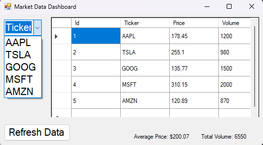

# MarketDashboard

A local desktop analytics dashboard built in C# (.NET Framework) with SQL Server.  
Simulates basic market data, allowing users to filter by ticker, view KPIs, and display live results in a clean Windows Forms interface.

---

## 🧩 Features
- ✅ Filter data by stock ticker
- ✅ Display average price and total volume
- ✅ Pull data directly from local SQL Server
- ✅ Responsive WinForms layout
- ✅ Clean code with full database setup

---

## 🖼️ Preview

---

## 🛠️ Setup Instructions

1. Install **SQL Server Express** and **SSMS** (SQL Server Management Studio)
2. Open `setup/marketdata.sql` in SSMS and run it to create the database
3. Open the `.sln` file in Visual Studio
4. Build and run the project

---

## 📁 Folder Structure

